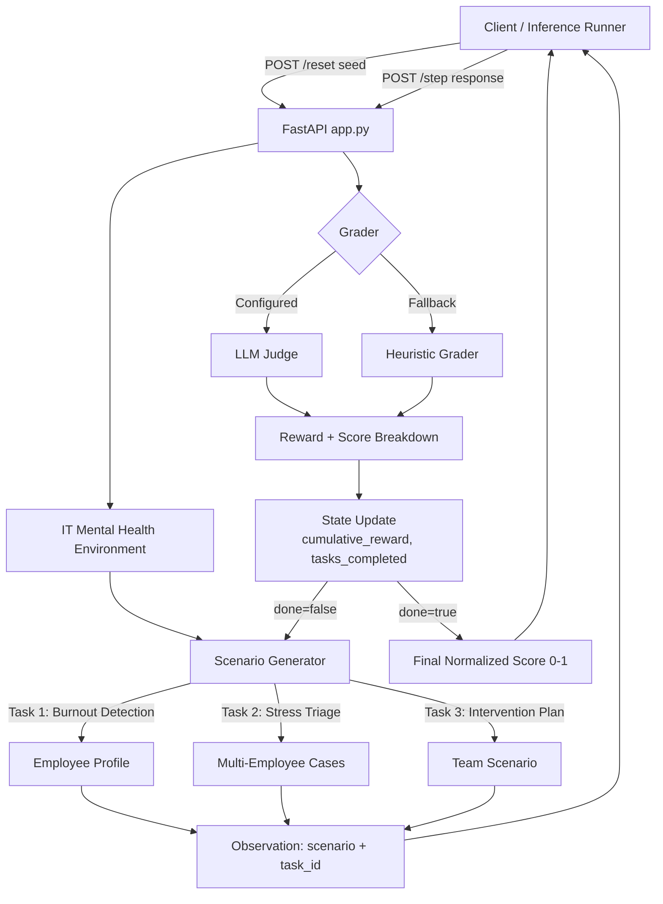

# IT Mental Health OpenEnv

An OpenEnv-compatible reinforcement learning environment for mental health assessment and intervention planning in the IT and software engineering sector.

Built for the [Scaler x Meta-PyTorch OpenEnv Hackathon 2026](https://www.scaler.com/school-of-technology/meta-pytorch-hackathon).

## Elevator Pitch

Modern IT teams operate under sprint pressure, on-call fatigue, remote isolation, and always-on expectations. Those stressors often appear long before a formal HR escalation, but most benchmark environments do not test whether an AI system can recognize burnout patterns, prioritize mental health risk, or propose realistic workplace interventions.

This project solves that gap by turning workplace mental health into a structured evaluation environment. Instead of asking an agent to solve toy problems, it asks the agent to:

1. detect burnout from an employee profile,
2. triage multiple employees by urgency, and
3. design a structured intervention plan for a team already showing systemic strain.

The result is a benchmark that is easier to pitch to judges because it is:

- socially meaningful,
- clearly scoped,
- grounded in recognizable workplace scenarios,
- measurable through rubric-based rewards, and
- extensible to future HR and wellbeing tasks.

## What Problem It Solves

Most LLM evaluation environments focus on navigation, coding, or generic QA. They do not measure whether an agent can reason through workplace mental health cases in a structured, actionable way.

This environment is designed to evaluate:

- recognition of burnout symptoms using the Maslach Burnout Inventory (MBI) framing,
- prioritization of urgent cases using tiered stress triage,
- generation of practical intervention plans rather than vague advice,
- structured communication quality,
- rewardable outputs for iterative benchmarking.

For a hackathon pitch, the core story is:

- burnout in IT is widespread,
- companies need earlier detection and more structured support,
- current AI benchmarks ignore this domain,
- this environment turns that real-world problem into a reproducible benchmark.

## Why This Is Useful in a Hackathon

This project works well for a benchmark-oriented hackathon because it gives judges three things at once:

- a novel domain,
- a technically runnable benchmark,
- a strong real-world narrative.

It is also practical for submission because:

- the API is simple and inspectable,
- the inference flow is reproducible,
- Docker packaging is supported,
- validation is built in,
- the benchmark returns normalized scores in `[0, 1]`.

## Functional Overview

The environment simulates three progressive tasks:

| Task ID | Difficulty | Goal |
|---|---|---|
| `burnout_detection` | Easy | Detect MBI dimensions, severity, red flags, and HR escalation need |
| `stress_triage` | Medium | Classify multiple employees by urgency and recommend immediate plus medium-term actions |
| `intervention_plan` | Hard | Build a 4-week recovery/intervention plan for a team in distress |

Each episode moves through those tasks in order. The agent receives a scenario, returns a text response, and gets:

- a reward,
- grader feedback,
- a score breakdown,
- and the next scenario until the episode ends.

## Benchmark Design

The benchmark is intentionally structured around realistic workplace mental health reasoning rather than open-ended chat.

### Task 1: Burnout Detection

The agent reviews a single employee profile and is expected to identify:

- MBI dimensions present,
- severity level,
- top red flags,
- whether immediate HR escalation is needed.

### Task 2: Stress Triage

The agent sees multiple employees and must:

- assign each a stress tier,
- identify likely primary stressor type,
- recommend one immediate action,
- recommend one medium-term support action,
- rank intervention priority.

### Task 3: Intervention Plan

The agent receives a team-wide burnout scenario and must produce:

- a 4-week phased plan,
- clear responsibilities,
- measurable outcomes,
- KPIs,
- a risk statement,
- a budget band.

## Architecture Diagram



## How the Environment Works

At a high level:

1. `POST /reset` starts a new episode and returns the first scenario.
2. `POST /step` accepts the agent's answer and advances the benchmark.
3. The environment tracks reward, progress, and task order.
4. `GET /state` exposes current episode metadata.
5. `GET /tasks` and `GET /schema` help inspection and integration.

The environment uses randomized scenario generation so episodes are not identical across resets unless a seed is supplied.

## Reward and Scoring

The environment uses rubric-based grading. Depending on runtime configuration, it can use:

- an LLM judge, or
- a heuristic fallback grader.

The fallback heuristic is currently important because it allows the benchmark to run even without a configured external judge model.

Reward properties:

- each task returns a normalized reward in `[0.0, 1.0]`,
- the score breakdown reports sub-dimension performance,
- the inference script outputs step rewards and a final normalized score.

### Rubric Themes

The grader looks for factors such as:

- clinical accuracy,
- completeness,
- relevance to the scenario,
- prioritization quality,
- structure and clarity,
- intervention practicality.

## Technical Architecture

This repository uses a flat root layout:

```text
it_mental_health_env/
|-- app.py
|-- it_mental_health_environment.py
|-- inference.py
|-- validate.py
|-- models.py
|-- openenv.yaml
|-- requirements.txt
|-- requirements_inference.txt
|-- .env.example
|-- .gitignore
|-- Dockerfile
`-- README.md
```

### File Responsibilities

- `app.py`
  FastAPI application exposing the benchmark endpoints.
- `it_mental_health_environment.py`
  Core environment logic, scenario generation, rubrics, grader flow, and state transitions.
- `models.py`
  Typed action, observation, and state models.
- `inference.py`
  Benchmark runner using the OpenAI client with the required env-variable contract.
- `validate.py`
  Pre-submission sanity checker for API health and scoring behavior.
- `openenv.yaml`
  OpenEnv manifest for the environment.
- `Dockerfile`
  Container packaging for local and HF Spaces style deployment.

## API Reference

### `GET /health`

Simple readiness check.

Example response:

```json
{
  "status": "ok",
  "env": "it_mental_health_env",
  "version": "1.0.0"
}
```

### `POST /reset`

Starts a new episode.

Request body:

```json
{
  "seed": 123
}
```

Notes:

- `seed` is optional.
- when `seed` is provided, the same episode scenario sequence can be reproduced.

### `POST /step`

Submits the agent's answer for the current task.

Request body:

```json
{
  "response": "Your structured answer here",
  "task_id": "burnout_detection",
  "confidence": 0.9,
  "metadata": {}
}
```

Notes:

- `metadata` is optional and can safely be `{}`.
- `task_id` should usually match the `task_id` returned by the latest observation.
- the environment itself advances task order internally.

### `GET /state`

Returns current episode progress.

### `GET /tasks`

Returns benchmark task metadata such as difficulty and description.

### `GET /schema`

Returns a human-readable action and observation schema.

## Request and Response Shapes

### Action

```json
{
  "response": "string",
  "task_id": "burnout_detection | stress_triage | intervention_plan",
  "confidence": 0.9,
  "metadata": {}
}
```

### Observation

```json
{
  "scenario": "string",
  "feedback": "string",
  "reward": 0.655,
  "done": false,
  "score_breakdown": {
    "example_dimension": 0.8
  },
  "task_id": "stress_triage",
  "metadata": {}
}
```

### State

```json
{
  "episode_id": "uuid",
  "step_count": 1,
  "current_task": "stress_triage",
  "cumulative_reward": 0.655,
  "tasks_completed": ["burnout_detection"]
}
```

## Running Locally

### 1. Install dependencies

```bash
pip install -r requirements.txt
pip install -r requirements_inference.txt
```

### 2. Start the API server

```bash
python -m uvicorn app:app --host 127.0.0.1 --port 7860
```

### 3. Explore the interactive docs

Open:

- `http://127.0.0.1:7860/docs`
- `http://127.0.0.1:7860/health`
- `http://127.0.0.1:7860/tasks`

### 4. Configure environment variables

Start from `.env.example`:

```env
API_BASE_URL=https://api-inference.huggingface.co/v1
MODEL_NAME=meta-llama/Llama-3.1-8B-Instruct
HF_TOKEN=
LOCAL_IMAGE_NAME=
ENV_BASE_URL=http://localhost:7860
```

Important notes:

- `HF_TOKEN` is required for the inference script.
- `LOCAL_IMAGE_NAME` is optional and can stay empty in this repo's current HTTP-server workflow.
- `ENV_BASE_URL` should point to your local FastAPI server.

### 5. Run the inference script

```bash
python inference.py
```

## Inference Script Contract

The hackathon requires the inference runner to follow a specific pattern. This repository's `inference.py` is aligned to that requirement:

- it uses the OpenAI client for all LLM calls,
- it reads `API_BASE_URL`, `MODEL_NAME`, and `HF_TOKEN`,
- it includes optional `LOCAL_IMAGE_NAME`,
- it emits plain-text structured logs to stdout.

### Required stdout format

```text
[START] task=burnout_detection env=it_mental_health_env model=meta-llama/Llama-3.1-8B-Instruct
[STEP] step=1 action=... reward=0.72 done=false error=null
[STEP] step=2 action=... reward=0.68 done=false error=null
[END] success=true steps=2 score=0.467 rewards=0.72,0.68
```

Rules followed:

- exactly one `[START]` line,
- one `[STEP]` line per environment step,
- one `[END]` line even if execution fails,
- rewards formatted to two decimals in step logs,
- final score normalized to `[0, 1]`.

## Manual API Testing

If you want to test without the inference script:

1. call `POST /reset`,
2. copy the returned `scenario` and `task_id`,
3. write a structured response,
4. send it to `POST /step`,
5. inspect `reward`, `feedback`, and `score_breakdown`.

Example `POST /step` payload:

```json
{
  "response": "1. MBI Dimensions\nExhaustion and Depersonalization are present.\n\n2. Severity\nHigh.\n\n3. Top 3 Red Flags\n- Long working hours\n- Extended period without vacation\n- Emotional detachment\n\n4. HR Escalation\nYes. The presentation suggests serious burnout risk and warrants prompt support.",
  "task_id": "burnout_detection",
  "confidence": 0.9,
  "metadata": {}
}
```

## Validation

Run the pre-submission validator after the server is up:

```bash
python validate.py
```

What it checks:

- manifest validity,
- root `inference.py` presence,
- `/health`,
- `/reset`,
- `/step`,
- `/state`,
- reward range compliance.

## Docker Usage

Build:

```bash
docker build -t it-mental-health-env .
```

Run:

```bash
docker run -p 7860:7860 it-mental-health-env
```

Then visit:

- `http://127.0.0.1:7860/health`
- `http://127.0.0.1:7860/docs`

## Pitching Notes for Judges

If you are demoing this live, emphasize:

- **Domain relevance**
  This benchmark addresses a real workplace problem with growing urgency.
- **Novel evaluation target**
  Most environments do not evaluate burnout detection, triage, or intervention planning.
- **Structured benchmark**
  The project is not just a chatbot; it is a measurable RL-style environment with rewards and step transitions.
- **Technical completeness**
  It includes API endpoints, validation, an inference runner, Docker packaging, and an OpenEnv manifest.
- **Extensibility**
  Future tasks could include return-to-work support, manager coaching, policy audits, absenteeism risk, or escalation workflows.

## Current Limitations

It is useful to be transparent about the current scope:

- the benchmark is primarily for structured evaluation, not clinical diagnosis,
- heuristic fallback grading can be blunt compared with a stronger external judge model,
- the current flow is benchmark-first rather than custom-case analysis first,
- duplicate names can occasionally appear in generated scenarios and affect grading clarity.

## Suggested Future Improvements

- add a custom scenario endpoint for real-world demos,
- improve scenario diversity and de-duplicate names within multi-person cases,
- strengthen grading with a more robust external LLM judge,
- add analytics dashboards for reward trends and failure modes,
- expand task coverage into HR escalation and manager support planning.

## License

MIT
